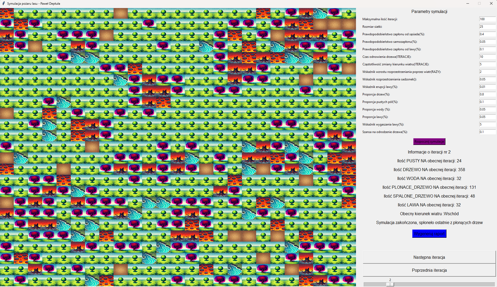

# 🌲🔥 Symulacja pożaru lasu

> **Autor:** Paweł Deptuła  
> **Technologie:** Python 3 · Tkinter · NumPy · Matplotlib · ReportLab

---

## 📝 Opis projektu

Projekt przedstawia graficzną symulację rozprzestrzeniania się pożaru w środowisku leśnym.  
Użytkownik może w czasie rzeczywistym obserwować, jak ogień przechodzi z drzewa na drzewo, wchodzi w interakcję z elementami otoczenia (wodą, lawą) oraz jak zmienia go wiatr.  
Aplikacja pozwala swobodnie eksperymentować z parametrami, by analizować wpływ różnych czynników na dynamikę pożaru.

---

## ⚙️ Główne funkcjonalności

|        | Opis |
| ------ | ---- |
| 🔥 **Dynamiczna symulacja ognia** | Płonące drzewa podpalają sąsiadów zgodnie z ustalonym prawdopodobieństwem; po wypaleniu stają się pogorzeliskiem. |
| 🌳 **Pełna konfiguracja parametrów** | Pola wejściowe pozwalają ustawić m.in. prawdopodobieństwo zapłonu (_od sąsiada, od lawy, samozapłon_), częstotliwość zmiany wiatru, czas regeneracji drzew czy proporcje las / woda / lawa. |
| 🌋 **Erupcje lawy** | Losowe wybuchy lawy inicjują nowe ogniska pożaru i dodają dynamiki symulacji. |
| 💧 **Woda jako bariera** | Zbiorniki wodne blokują rozprzestrzenianie się ognia, wprowadzając dodatkową strategię w planowaniu lasu. |
| 💨 **Wiatr z kierunkiem i siłą** | Kierunek wiatru (zmienny w trakcie symulacji) wzmacnia pożar zgodnie z ustalonym mnożnikiem. |
| 📈 **Statystyki w czasie rzeczywistym** | Liczba pustych pól, żywych \& płonących drzew, wody, lawy itd. odświeżana co iterację. |
| 🖼 **Interaktywna oś czasu** | Suwak + przyciski _Poprzednia_/ _Następna iteracja_ pozwalają „przewijać” przebieg pożaru klatka po klatce i analizować konkretne stany siatki. |
| 🗂 **Generowanie raportu PDF** | Jednym kliknięciem tworzony jest raport zawierający: parametry startowe, wyniki końcowe, wykres zmian w czasie oraz zrzut ekranu. |

---

## 🖥️ Interfejs graficzny

- **Panel parametrów (prawy bok):**  
  Wprowadzanie wartości liczbowych (entry boxy) + przycisk `Rozpocznij symulację`.
- **Wizualizacja siatki (lewa strona):**  
  - zielone 🌳 = drzewa  
  - czerwone 🔥 = płonące drzewa  
  - czarne ⬛ = spalone drzewa / pogorzelisko  
  - niebieskie 💧 = woda  
  - pomarańczowe 🌋 = lawa  
- **Podgląd iteracji (dół):**  
  Informacje tekstowe + suwak czasu + przyciski do ręcznego przeglądania klatek.
- **Raport i wykresy:**  
  Po zakończeniu symulacji aktywuje się przycisk `Wygeneruj raport`, tworzący PDF z podsumowaniem i obrazami.

---

## 🎯 Cel projektu

Celem jest edukacyjne przedstawienie zjawiska pożaru lasu oraz możliwości jego modelowania w prostym środowisku symulacyjnym.  
Projekt może służyć jako:

1. **Narzędzie dydaktyczne** – pokazujące wpływ czynników środowiskowych na rozwój ognia.  
2. **Podstawa do dalszych badań** – łatwo rozszerzyć o nowe reguły lub elementy (np. różne gatunki drzew, straż pożarną).  
3. **Prezentacja możliwości Tkintera** – demonstracja tworzenia interaktywnych, bogatych graficznie aplikacji w czystym Pythonie.

---

> **Licencja:** MIT  
> **Kontakt:** https://www.linkedin.com/in/pawe%C5%82-deptu%C5%82a/
